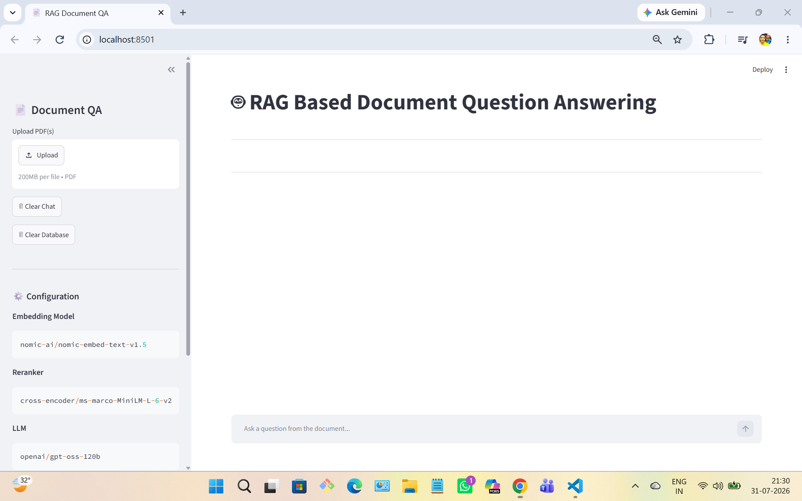
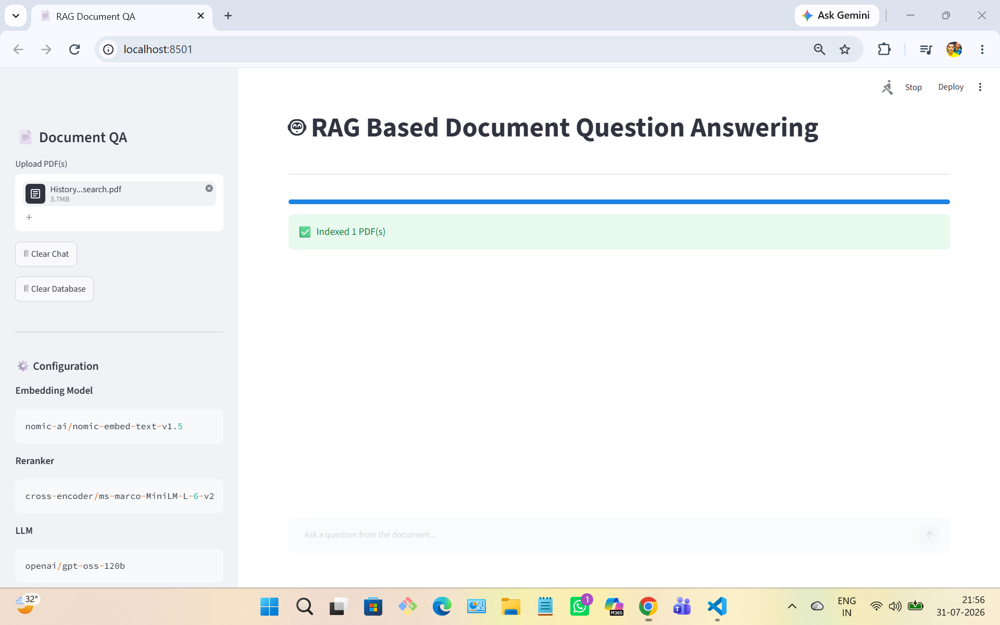
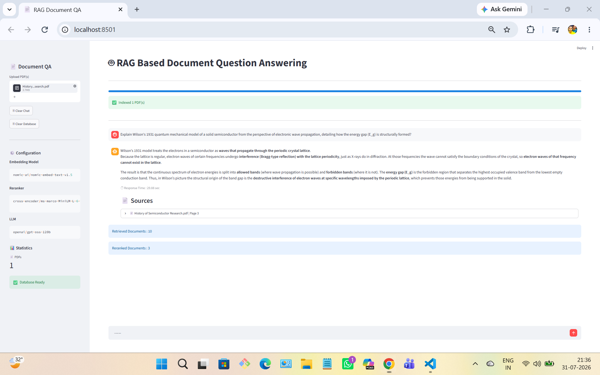

# 📄 RAG-Based Document Question Answering System

An intelligent **Retrieval-Augmented Generation (RAG)** application that allows users to upload PDF documents and ask natural language questions. The system retrieves the most relevant document chunks, reranks them using a Cross-Encoder model, and generates accurate answers using **GPT-OSS-120B**.

---

## 🚀 Features

- 📄 Upload one or multiple PDF documents
- 🔍 Automatic document parsing and chunking
- 🧠 Semantic search using HuggingFace embeddings
- 🗂️ ChromaDB vector database for efficient retrieval
- 🎯 Cross-Encoder reranking for improved relevance
- 🤖 Answer generation using GPT-OSS-120B
- 📌 Source citations with page numbers
- 💬 Interactive Streamlit chat interface
- ⚡ Fast retrieval and response generation

---

## 🛠️ Tech Stack

- Python
- Streamlit
- LangChain
- ChromaDB
- HuggingFace Embeddings
- Cross-Encoder (MS MARCO MiniLM)
- Groq API
- GPT-OSS-120B

---

## 📂 Project Structure

```text
RAG-Document-QA/
│
├── app.py
├── config.py
├── ingest.py
├── requirements.txt
├── README.md
├── .gitignore
├── .env.example
│
├── data/
├── chroma_db/
│
├── utils/
│   ├── parser.py
│   ├── chunker.py
│   ├── embeddings.py
│   ├── vectorstore.py
│   ├── retriever.py
│   ├── reranker.py
│   ├── llm.py
│   └── prompt.py
│
└── screenshots/
```

---

## ⚙️ System Workflow

```text
                PDF Upload
                    │
                    ▼
             Document Parsing
                    │
                    ▼
               Text Chunking
                    │
                    ▼
         HuggingFace Embeddings
                    │
                    ▼
             ChromaDB Vector Store
                    │
                    ▼
          Semantic Similarity Search
                    │
                    ▼
          Cross-Encoder Reranking
                    │
                    ▼
             GPT-OSS-120B (LLM)
                    │
                    ▼
          Final Answer + Citations
```

---

## 📦 Installation

### Clone Repository

```bash
git clone https://github.com/YOUR_USERNAME/RAG-Document-QA.git

cd RAG-Document-QA
```

### Create Virtual Environment

```bash
python -m venv venv
```

Windows

```bash
venv\Scripts\activate
```

Linux / macOS

```bash
source venv/bin/activate
```

### Install Dependencies

```bash
pip install -r requirements.txt
```

---

## 🔑 Environment Variables

Create a `.env` file in the project root.

```env
GROQ_API_KEY=YOUR_GROQ_API_KEY
```

---

## ▶️ Run the Application

```bash
streamlit run app.py
```

The application will be available at:

```
http://localhost:8501
```

---

## 💬 Example Questions

- What is AGDS?
- Explain the objective of this document.
- Summarize the uploaded report.
- What are the key findings?
- List the important technologies mentioned.

---

## 📸 Screenshots

### Home Page


### PDF Upload


### Generated Answer

---

## 🎯 Future Improvements

- Conversation Memory
- Streaming Responses
- Hybrid Search (BM25 + Vector Search)
- OCR Support for Scanned PDFs
- Multi-Document Collections
- Docker Deployment
- User Authentication
- REST API Integration

---

## 👨‍💻 Author

**Anurag**

---

## ⭐ If you found this project useful, consider giving it a Star!